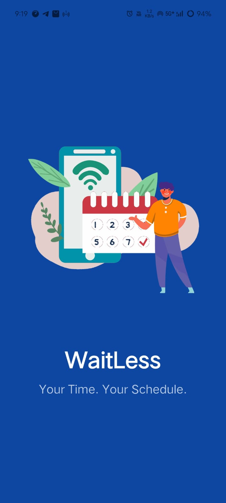
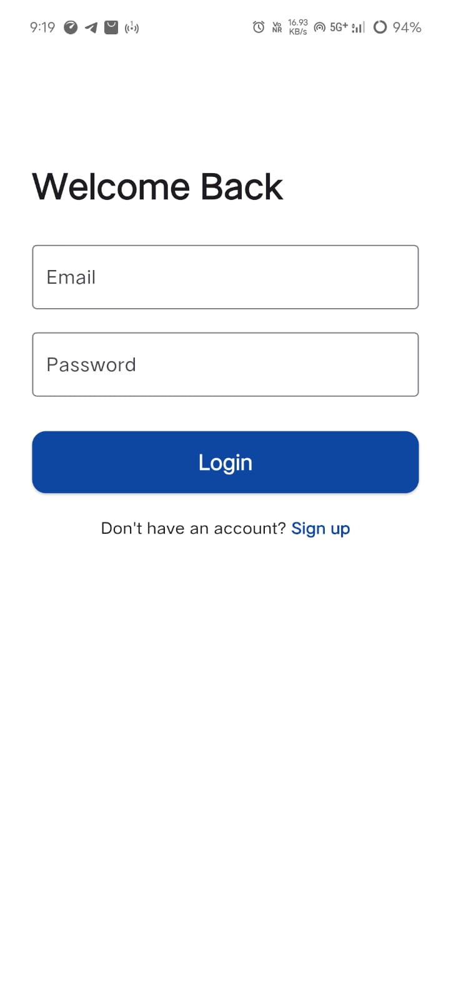

# waitless APP :
- Waitless — Smart Queue & Appointment Management App

# Overview :
Waitless is a Flutter-based application designed to simplify appointment and queue management for both customers and businesses.
It provides seamless scheduling, real-time updates, and an efficient interface for better service experiences.

# Features :
- **User role selection (Customer / Business) :** Allows users to choose their role as either a Customer or Business owner, enabling personalized dashboards and features.
- **Easy appointment booking:** Enables customers to book appointments quickly and conveniently with just a few taps.
- **Real-time updates and notifications:** Provides instant updates and notifications for appointment confirmations, cancellations, and reminders.
- **Business profile management:** Lets business owners create, edit, and manage their profiles, including shop details, timings, and customer appointments.
- **Search and category-based navigation:** Allows users to browse services by category or search for specific businesses in their area effortlessly.
- **Modern UI with Flutter:** Features a clean, responsive, and modern interface built using Flutter for a seamless cross-platform experience.

# Tech Stack
- **Flutter:**  The primary framework used for developing the app, providing a rich set of features for mobile app development.
- **Dartr:** The programming language used for developing the app, known for its efficiency and ease of use with Flutter.
- **Storage:** Shared Preferences

# Dependencies
- **flutter**: The core SDK used to build the WaitLess mobile application for both Android and iOS platforms.
- **cupertino_icons**: Used for iOS-style icons to maintain a clean and consistent interface.
- **shared_preferences**: Helps store user login, signup, and role data locally to enable smooth user experience without backend dependency.
- **url_launcher: Allows** users to open Google Maps or external URLs directly from the app, making navigation easier.
- **intl**: Used for date formatting and localization support across the app, especially in appointment and scheduling features.

# How It Works
- **Signup / Login:** Users register as customers or business owners.
- **Role Selection:** After login, users choose their role.
- **Business Dashboard:** Businesses manage their shop and appointments.
- **customer Dashboard:** Customers view nearby businesses and book slots.
- **Appointment Management:** Choose date & time, view status, and updates.

# Future Improvements
- Add analytics dashboard for businesses
- Push notifications
- Online payment integration

# Getting Started
To run this project locally, ensure you have Flutter installed. Follow these steps:

1. Clone the repository:
```bash
    git clone https://github.com/prasadghadwaje/Waitless-For-Hakathon.git 
```
2. Navigate to the project directory:
```bash
    cd Waitless-For-Hakathon
```
3. Install dependencies:
```bash
    flutter pub get 
```
4. Run App:
```bash
    flutter run
```
# Project Output Screenshots
Below are some screenshots from the project's user interface.

## Splash Screen


## Login Screen


## Customer Home Screen


## Customer Profile Screen

